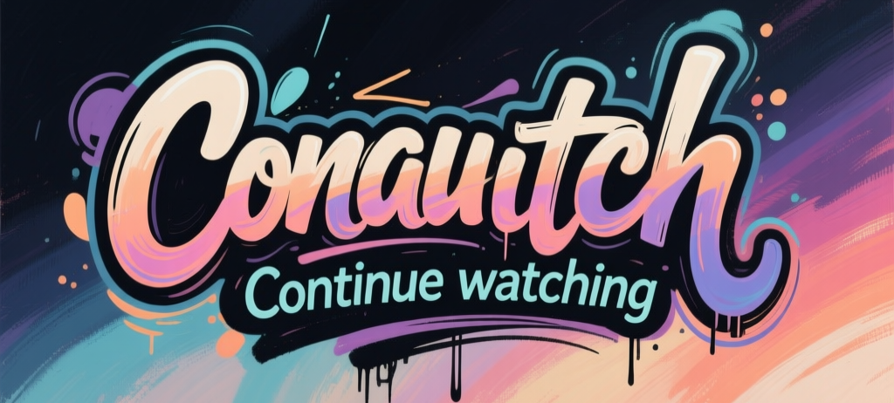

# Conwatch

---

Conwatch lets you save and resume anything you watch—movies, series, anime, lectures, streams—no matter which website you’re on. With a simple keyboard shortcut, you can save your progress and pick it right back up from a sleek, modern side panel.

---

## ✨ Key Features

- **Universal Tracking**: Works with the standard `<video>` tag on almost any website.
- **One-Click Save**: Manually save your video progress with a customizable keyboard shortcut (`Alt+Shift+M` by default).
- **Instant Access Side Panel**: Open a clean, intuitive side panel to see your whole watchlist (`Alt+Shift+N` by default).
- **Detailed Tracking**: Remembers the video's:
    - Title
    - Season & Episode (if available)
    - Thumbnail
    - Direct Link
    - Exact Timestamp
- **Smart Autosave**: Automatically saves your progress when you leave a tracked site (e.g., Netflix, YouTube). You control which sites to track!
- **Modern UI**:
    - Light & Dark modes.
    - Pin videos to the top.
    - Quickly remove videos from your list.
    - Add a video from your current tab directly from the side panel.

##  browsers Supported Browsers

Conwatch is built with cross-browser compatibility in mind and works seamlessly on:

- **Google Chrome** (and other Chromium browsers like **Opera**, **Brave**, **Zen**)
- **Mozilla Firefox**

## 🚀 Installation

This project doesn't require a build system. You can load it directly into your browser.

### For Google Chrome (and Chromium Browsers)
1.  Navigate to `chrome://extensions`.
2.  Enable **"Developer mode"** in the top-right corner.
3.  Click **"Load unpacked"**.
4.  Select the `both` directory from the project folder.

### For Mozilla Firefox
1.  Navigate to `about:debugging#/runtime/this-firefox`.
2.  Click **"Load Temporary Add-on..."**.
3.  Select the `manifest.firefox.json` file from the project folder.

## 🎮 How to Use

1.  **Open the Side Panel**: Press `Alt+Shift+N`.
2.  **Save a Video Manually**: When on a page with a video, press `Alt+Shift+M`.
3.  **Customize Shortcuts**: Go to your browser's extension keyboard shortcut settings to change the keybindings.
    - Chrome: `chrome://extensions/shortcuts`
4.  **Manage Your List**:
    - **Play**: Click the play button on a video's thumbnail in the side panel to jump right back in.
    - **Pin/Remove**: Use the 3-dot menu on any video to pin it or remove it.
    - **Add Current**: Click the `+` button in the side panel to add the video from your active tab.
5.  **Configure Settings**:
    - Open the side panel and click the settings icon.
    - Toggle between light and dark themes.
    - Add or remove websites from the autosave list.

## ✍️ Author

Created with **[Yoruboku](https://github.com/yoruboku)** by Gemini
## 📄 License

This project is licensed under the MIT License - see the [LICENSE](LICENSE) file for details.
